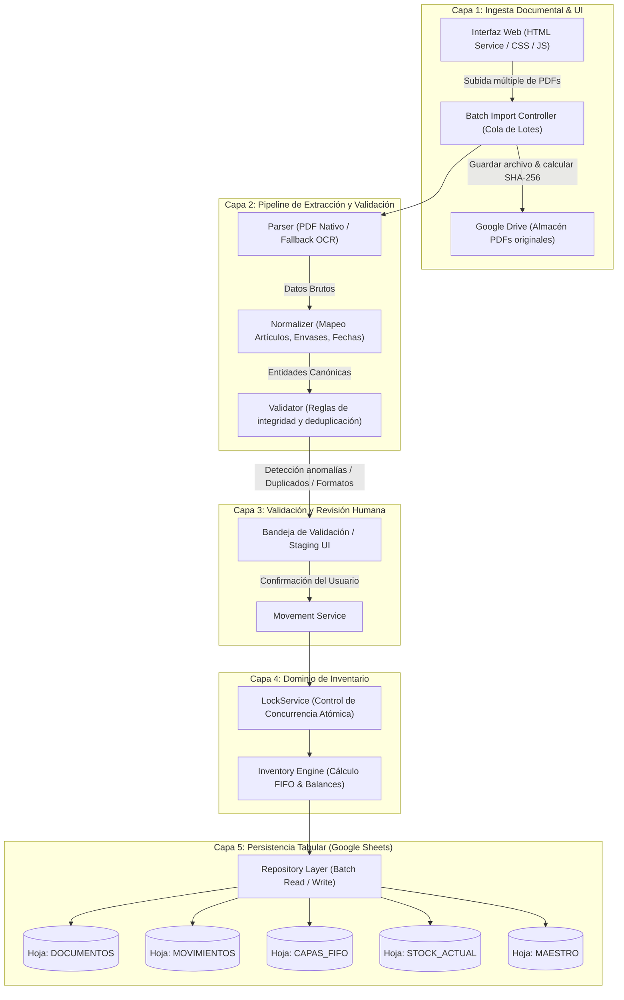
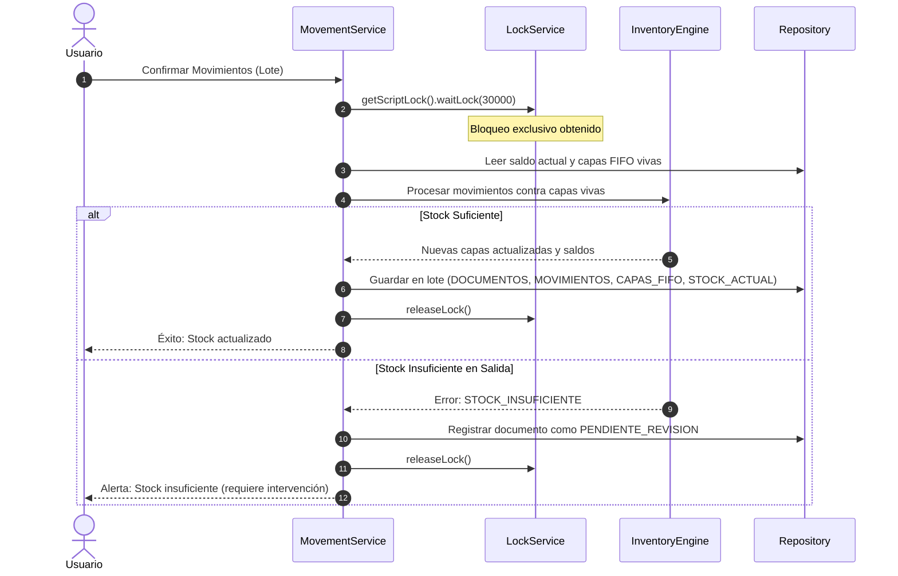

# ARCHITECTURE.md — Arquitectura de STOCK-LIGHT

## 1. Principios de Diseño del Sistema

STOCK-LIGHT está concebido bajo cinco principios rectores:

1. **Simplicidad Táctica y Cero Sobrediseño:** Diseñado específicamente para volúmenes pequeños y medianos de albaranes diarios. Se prescinde de bases de datos externas pesadas (PostgreSQL/Supabase) y microservicios; se aprovecha la infraestructura nativa de Google Workspace (Apps Script, Sheets y Drive).
2. **Separación Estricta de Responsabilidades:** Cada capa cumple un rol único y no tiene conocimiento del funcionamiento interno de las capas adyacentes.
3. **Inmutabilidad del Historial (Event Sourcing Minimalista):** El stock nunca se modifica de forma destructiva o arbitraria. Todo cambio en el inventario es el resultado directo de un **Movimiento** (`ENTRADA`, `SALIDA` o `AJUSTE`).
4. **Determinismo FIFO:** La deducción de capas y existencias es un proceso matemático puro y determinista, completamente desacoplado de los documentos físicos y del formato de entrada.
5. **Tolerancia a Concurrencia y Cuotas:** Empleo de bloqueos atómicos (`LockService`) y procesamiento por lotes para respetar los límites de ejecución de Google Apps Script (máximo 6 minutos por hilo).

---

## 2. Diagrama General de Arquitectura



---

## 3. Desglose Detallado de Capas

### 3.1. Parser Layer (Extracción)
* **Responsabilidad:** Extraer texto crudo y líneas tabulares de los documentos PDF de Hispatec sin interpretar reglas de negocio.
* **Estrategia:**
  1. *Parser Primario:* Extracción directa de texto nativo de vectores PDF (rápido, sin consumo de cuota OCR).
  2. *Parser Secundario:* Fallback automático a OCR controlado únicamente cuando el PDF contiene imágenes escaneadas o no vectorizadas.
* **Contrato de Salida:** `RawDocumentPayload` conteniendo cabecera sin procesar y array de líneas de texto crudas.

### 3.2. Normalizer Layer (Normalización)
* **Responsabilidad:** Convertir el `RawDocumentPayload` en una estructura de datos canónica comprensible para STOCK-LIGHT.
* **Operaciones:**
  * Limpieza de cadenas y eliminación de saltos de línea irregulares.
  * Extracción de Serie y Número de documento mediante expresiones regulares estandarizadas.
  * Conversión de fechas a formato ISO (`YYYY-MM-DD`).
  * Normalización del código de artículo Hispatec y del tipo de envase/presentación.
  * Detección estricta de la cantidad de **Cajas** (descartando cualquier valor expresado en kilos).

### 3.3. Validator Layer (Validación y Deduplicación)
* **Responsabilidad:** Evaluar que el documento normalizado cumpla con las restricciones de negocio antes de ser admitido.
* **Comprobaciones:**
  * **Deduplicación Nivel 1:** Verificación del hash SHA-256 del archivo contra la hoja `DOCUMENTOS`.
  * **Deduplicación Nivel 2:** Verificación de la identidad compuesta `(tipo_documento, serie, numero, fecha)`.
  * **Integridad de Líneas:** Cajas > 0, existencia de código de artículo válido.
  * Si el documento es un duplicado o presenta datos ambiguos, se marca como `DUPLICADO` o `RECHAZADO` y no avanza al motor de inventario.

### 3.4. Movement Service (Orquestación de Movimientos)
* **Responsabilidad:** Coordinar el ciclo de vida del movimiento tras la confirmación de la revisión humana.
* **Operaciones:**
  * Genera IDs únicos para el documento y sus movimientos asociados.
  * Determina el tipo de movimiento (`ENTRADA`, `SALIDA` o `AJUSTE`).
  * Gestiona las llamadas al `Inventory Engine` y la persistencia de estados intermedios.

### 3.5. Inventory Engine (Motor de Inventario y FIFO Core)
* **Responsabilidad:** Núcleo puro de la lógica de stock. **No conoce la existencia de PDFs ni de Google Sheets.** Recibe movimientos normalizados en memoria y devuelve el nuevo estado de capas y existencias.
* **Operaciones:**
  * **Para ENTRADA:** Crea una nueva capa en `CAPAS_FIFO` con `cajas_iniciales = cajas_restantes`. Incrementa el saldo en `STOCK_ACTUAL`.
  * **Para SALIDA:** 
    1. Consulta las capas activas ordenadas por `fecha ASC, id_capa ASC`.
    2. Comprueba que `Σ(cajas_restantes) >= cajas_salida`.
    3. Si el stock es insuficiente: interrumpe la operación, genera un evento de alerta `STOCK_INSUFICIENTE` y deja la salida en estado `PENDIENTE_REVISION`. **Nunca genera saldo negativo silencioso.**
    4. Si hay stock suficiente: consume cajas de las capas más antiguas hasta completar el total requerido. Marca como `AGOTADA` toda capa con saldo restante 0.
    5. Reduce el saldo correspondiente en `STOCK_ACTUAL`.
  * **Para AJUSTES MANUALES:** Modifica capas y stock según el signo del ajuste (`+` genera capa de corrección, `-` consume FIFO por merma/rotura).

### 3.6. Repository Layer (Persistencia en Google Sheets)
* **Responsabilidad:** Abstracción sobre `SpreadsheetApp`.
* **Reglas:**
  * Operaciones estrictamente en bloque: uso obligatorio de `getValues()` y `setValues()` por rangos contiguos.
  * Prohibido iterar celdas individuales (antipatrón `getValue()` en bucle).
  * Hojas tratadas como tablas relacionales planas.
  * Cero fórmulas en la hoja para cálculos de negocio (la verdad la computa Apps Script).

---

## 4. Control de Concurrencia y Atomicidad

Para garantizar que múltiples cargas de documentos o ajustes manuales simultáneos no corrompan las capas FIFO ni produzcan condiciones de carrera (*race conditions*), se implementa el patrón de bloqueo con `LockService`:



---

## 5. Adaptabilidad Futura y Desacoplamiento

El sistema está diseñado de tal forma que una fuente de datos futura (por ejemplo, exportaciones en formato CSV, XML o una API directa de Hispatec) no requerirá modificar una sola línea del motor de inventario ni de la persistencia:

```text
[PDF Hispatec]    ──> [PdfParser]    ──┐
[CSV Futuro]      ──> [CsvParser]    ──┼─> [Normalizer] ──> [Movement Service] ──> [Inventory Engine]
[API Rest Futura] ──> [ApiParser]    ──┘
```

El único requisito para añadir una nueva fuente será implementar una interfaz de parser que devuelva el objeto estandarizado `NormalizedMovementInput`.
