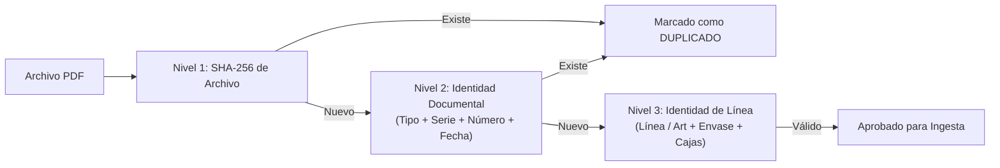

# BUSINESS_RULES.md — Reglas de Negocio de STOCK-LIGHT

## 1. Definición de la Unidad de Existencia

En STOCK-LIGHT, la unidad elemental de existencia es el par biunívoco:

$$\text{Unidad de Stock} = \langle \text{CÓDIGO DE ARTÍCULO HISPATEC}, \; \text{TIPO DE ENVASE / PRESENTACIÓN} \rangle$$

### Principios Fundamentales:
1. **Relación $1:N$ (Artículo - Envase):** Un mismo código de artículo puede comercializarse y almacenarse en múltiples envases o presentaciones. Cada combinación constituye un saldo de inventario **completamente independiente**.
   * *Ejemplo:*
     * `2112000 | TOMATE ROSA M | EPS 104` $\rightarrow$ Saldo A (ej. 150 cajas)
     * `2112000 | TOMATE ROSA M | EPS 106 9x500` $\rightarrow$ Saldo B (ej. 80 cajas)
     * El consumo del Saldo A no afecta ni compensa el Saldo B.
2. **Unidad de Medida Exclusiva: CAJAS / ENVASES:**
   * El cálculo de inventario en STOCK-LIGHT se realiza **única y exclusivamente en Cajas / Envases**.
   * **Queda estrictamente prohibido usar Kilos para deducir o computar existencias.** Los kilos son un valor comercial o de báscula que no refleja el stock físico unitario de empaques.
3. **Propiedad CA de Hispatec:** La gestión o partición de existencias por la propiedad "CA" (Confección en Almacén / Campo) **NO forma parte del MVP** y no se implementa en esta fase.
4. **Grupos Comerciales:**
   * Los grupos comerciales (ej. "TOMATE ROSA") son exclusivamente una **capa de consulta, agregación y filtro visual**.
   * **No participan en el cálculo de stock ni en las deducciones FIFO.**
5. **Grupos de Envase:**
   * Las agrupaciones de envase (ej. "EPS", "JAPONÉS CARTÓN", "JAPI", "OTROS") constituyen una **capa puramente consultiva, de agregación y filtro visual**.
   * **No participan en:**
     * Cálculo de saldo de stock (la unidad de inventario sigue siendo estrictamente `CODIGO_ARTICULO + CODIGO_ENVASE`).
     * Creación de movimientos en la tabla `MOVIMIENTOS`.
     * Consumo o deducción cronológica de capas FIFO.
     * Reconciliación o reconstrucción de existencias (`rebuildStock`).
   * Todo envase no mapeado formalmente en la tabla `GRUPOS_ENVASE` se clasifica sin conjeturas como `SIN_CLASIFICAR`.

---

## 2. Ecuación Maestra de Inventario e Inmutabilidad

$$\text{EXISTENCIAS ACTUALES} = \sum \text{ENTRADAS} - \sum \text{SALIDAS} \pm \sum \text{AJUSTES}$$

### Regla de Oro de Inmutabilidad:
* **Las existencias jamás se editan directamente en la base de datos.**
* Ningún usuario ni proceso puede modificar el número de stock sin que exista un registro inmutable en la tabla `MOVIMIENTOS`.
* Toda variación de saldo es consecuencia de un evento documentado y trazable.

---

## 3. Fuentes de Movimiento Documental

### 3.1. Entradas de Mercancía en el MVP Activo

En el MVP actual de STOCK-LIGHT, las entradas de inventario proceden **únicamente de Albaranes de Compra**:

#### A) Albarán de Compra (Fuente Activa Exclusiva de Entradas)
* **Función:** Refleja compras directas de producto a proveedores o agricultores (Series `ACT`, `NT`, etc.).
* **Extracción requerida:**
  * Fecha de albarán.
  * Serie y Número de documento.
  * Proveedor (Código y Razón Social).
  * Código de Artículo y Descripción.
  * Código de Envase y Descripción.
  * **Número de Envases / Bultos / Cajas** (Dato crítico de stock).
  * Partida (si existe en el documento; se conserva como atributo informativo).
* **Tratamiento:** Cada línea de artículo genera una nueva capa FIFO y un movimiento tipo `ENTRADA`.

#### B) Documento de Recepción de Mercancía (Fuera del MVP Activo)
> [!NOTE]
> La ingesta de documentos de recepción de mercancía (medianería) ha quedado **fuera del alcance del MVP activo** según la Fase 2.1. El parser correspondiente permanece desacoplado e inactivo y no forma parte del flujo de importación ni de la inicialización del sistema.

### 3.2. Salidas de Mercancía

* Las salidas proceden exclusivamente de **Albaranes de Salida** de Hispatec.
* **Extracción requerida:**
  * Fecha de salida.
  * Serie y Número de documento.
  * Cliente (Razón Social).
  * Código de Artículo y Descripción.
  * Envase / Presentación.
  * **Cajas reales despachadas**.
* **Tratamiento:** Descuenta cajas de las capas FIFO correspondientes.

### 3.3. Documentos e Informes Excluidos del MVP
* **Informes de "Análisis de ventas por partida":** Quedan **estrictamente excluidos** como fuente de inventario. Dichos informes consolidan o duplican partidas por ventas parciales y desvirtúan el flujo cronológico de documentos primarios.

---

## 4. Motor FIFO (First-In, First-Out)

### 4.1. Filosofía FIFO en STOCK-LIGHT
* FIFO es una **regla determinista de cálculo de existencias**, **no un sistema de trazabilidad física**.
* La herramienta no pretende certificar qué palet o caja física exacta cargó el transportista en el muelle; garantiza que el stock disponible contablemente se valore y agote en estricto orden cronológico de entrada.

### 4.2. Estructura y Ciclo de Vida de las Capas FIFO
Cada entrada genera una **Capa FIFO** con los siguientes atributos:
* `id_capa`: Identificador secuencial unívoco.
* `id_movimiento_entrada`: Vínculo al movimiento origen.
* `fecha`: Fecha de entrada del documento.
* `codigo_articulo` y `codigo_envase`: Clave de stock.
* `cajas_iniciales`: Cantidad original ingresada.
* `cajas_restantes`: Saldo vivo pendiente de consumo.
* `partida`: Partida física asociada (informativa).
* `documento_ref`: Referencia del albarán de compra o recepción.
* `estado`: `ACTIVA` si $\text{cajas\_restantes} > 0$; `AGOTADA` si $\text{cajas\_restantes} = 0$.

### 4.3. Algoritmo de Consumo en Salidas
Ante un movimiento de salida de $N$ cajas para el par $\langle \text{artículo}, \text{envase} \rangle$:
1. Se recuperan todas las capas con estado `ACTIVA` ordenadas por `fecha ASC, id_capa ASC`.
2. Se verifica que $\sum \text{cajas\_restantes} \ge N$.
3. Se itera secuencialmente consumiendo saldo:
   * Si la capa actual tiene $\le$ cajas que las requeridas: se agota la capa ($\text{cajas\_restantes} = 0$, estado `AGOTADA`) y se descuenta dicha porción de la necesidad.
   * Si la capa actual tiene $>$ cajas que las requeridas: se deduce la cantidad exacta ($\text{cajas\_restantes} = \text{cajas\_restantes} - \text{cajas\_solicitadas}$) y la necesidad queda cubierta.
4. Las capas con $\text{cajas\_restantes} > 0$ se conservan vivas para las jornadas siguientes.

### 4.4. Operativa Diaria y Arrastre de Saldo
* El sistema **no recalcula toda la historia desde el origen de los tiempos cada día**.
* La operativa diaria trabaja arrastrando el conjunto de **capas vivas**. Las capas agotadas en días anteriores pasan a histórico y no participan en iteraciones posteriores.

---

## 5. Política de Stock Insuficiente (Déficit y Saldo Negativo)

### Prohibición de Stock Negativo Silencioso:
* El sistema **nunca permitirá que una salida genere saldo negativo de forma invisible**.
* Si una salida solicita $N$ cajas y el stock disponible actual es $S < N$:
  1. El movimiento **NO se aplica directamente al stock ni a las capas FIFO**.
  2. El documento se marca automáticamente con el estado:  
     `STOCK_INSUFICIENTE / PENDIENTE_REVISION`.
  3. El sistema expone el desglose de discrepancia:
     * **Stock disponible en capas:** $S$ cajas.
     * **Cajas requeridas en documento:** $N$ cajas.
     * **Déficit a justificar:** $N - S$ cajas.
  4. El usuario responsable deberá resolver el déficit mediante:
     * La importación de un albarán de entrada que faltaba por procesar.
     * Un ajuste manual debidamente justificado (ej. corrección de inventario inicial).

---

## 6. Ajustes Manuales de Inventario

Cuando se producen situaciones físicas reales que difieren del flujo documental estándar (roturas, destríos, mermas, diferencias en recuentos de almacén o reprocesados/reconversiones físicas):
* **NO se implementan conversiones automáticas complejas ni reprocesados en el código.**
* Toda corrección se efectúa mediante **Ajustes Manuales Tipificados**.

### Catálogo de Motivos de Ajuste:
| Motivo | Signo Habitual | Descripción |
| :--- | :---: | :--- |
| `MERMA` | `-` | Pérdida de peso o producto desechado por tiempo/calidad |
| `ROTURA` | `-` | Daño accidental de cajas o envases durante manipulación |
| `DETERIORO` | `-` | Producto no apto comercialmente |
| `DIFERENCIA_INVENTARIO` | `+` / `-` | Ajuste tras recuento físico periódico en almacén |
| `CORRECCION` | `+` / `-` | Enmienda por error humano previo en digitación o lectura |

### Requisitos Obligatorios de un Ajuste:
Todo ajuste manual debe almacenar obligatoriamente:
* Marca temporal (`YYYY-MM-DD HH:mm:ss`).
* Correo / Identificador del usuario que ejecuta el ajuste.
* Clave de stock: Artículo + Envase.
* Cantidad de cajas y Signo (`+` o `-`).
* Motivo formal tipificado.
* Texto libre de observaciones / Justificación.

---

## 7. Estrategia Multicapa de Deduplicación

Para blindar al sistema frente a subidas accidentales dobles, importaciones solapadas por rangos de fechas o reintentos de red, se implementan tres niveles de comprobación:

1. **Nivel 1 (Hash SHA-256 del Archivo):** Si el binario exacto del PDF ya fue registrado previamente en la hoja `DOCUMENTOS`, se rechaza de inmediato sin procesar.
2. **Nivel 2 (Identidad Documental Compuesta):** Clave única `(tipo_documento, serie, numero, fecha)`. Si un usuario escaneó de nuevo el mismo documento físico con diferente resolución (cambiando el hash del archivo), el Nivel 2 detecta la coincidencia exacta de la serie y número de albarán.
3. **Nivel 3 (Tolerancia a Períodos Solapados):** Si se importan albaranes que cubren fechas concurrentes, el sistema filtra y descarta solo aquellos documentos individuales previamente consolidados, procesando únicamente los nuevos.
