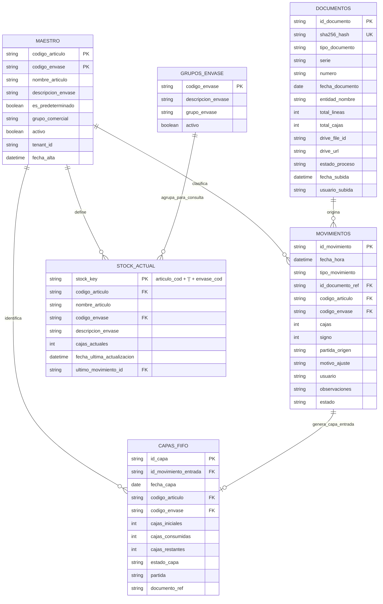

# DATA_MODEL.md — Modelo de Datos y Persistencia

## 1. Estrategia de Persistencia

La persistencia de STOCK-LIGHT se basa en un **Libro de Google Sheets dedicado**, administrado programáticamente por Google Apps Script.

### Principios de Almacenamiento:
1. **Google Sheets como Base de Datos Tabular:** Las pestañas de la hoja funcionan como tablas relacionales normalizadas.
2. **Cero Fórmulas de Negocio en Celdas:** No se utilizan fórmulas de hoja de cálculo (`VLOOKUP`, `SUMIFS`, `QUERY`, `IMPORTRANGE`) para calcular stocks o enlazar movimientos. Las fórmulas dinámicas provocan bloqueos, recálculos lentos e inconsistencias durante escrituras concurrentes. La lógica reside al 100% en Apps Script.
3. **Escritura y Lectura Atómica en Lote:** Todas las interacciones con `SpreadsheetApp` se efectúan mediante rangos contiguos (`getRange(1, 1, rows, cols).getValues()` y `.setValues()`), minimizando el tiempo de conexión con el servicio.
4. **Google Drive como Almacén de Binarios:** Los archivos PDF originales se custodian en una carpeta dedicada de Google Drive, guardando su identificador (`drive_file_id`) y enlace seguro en la tabla `DOCUMENTOS`.

---

## 2. Diagrama Entidad-Relación (ER)

---

## 3. Especificación Detallada de Tablas

### 3.1. Tabla: `MAESTRO`
Catálogo de referencia para validación y enriquecimiento de nombres de artículos y tipos de envase.

| Campo | Tipo | Nulo | Descripción / Regla |
| :--- | :--- | :---: | :--- |
| `codigo_articulo` | `VARCHAR(50)` | NO | Código oficial del artículo en Hispatec (PK compuesta). |
| `codigo_envase` | `VARCHAR(50)` | NO | Código o identificador del envase/caja (PK compuesta). |
| `nombre_articulo` | `VARCHAR(150)`| NO | Nombre legible de la variedad o producto. |
| `descripcion_envase` | `VARCHAR(100)`| NO | Descripción del formato (ej. "EPS 104", "Madera 50x30"). |
| `es_predeterminado` | `BOOLEAN` | SÍ | `TRUE` si es el envase predeterminado/habitual de compras para este artículo. |
| `grupo_comercial` | `VARCHAR(100)`| SÍ | Agrupación analítica (ej. "Tomate Rosa", "Calabacín"). Solo para filtros visuales. |
| `activo` | `BOOLEAN` | NO | `TRUE` si se encuentra en uso activo; `FALSE` si está descontinuado. |
| `tenant_id` | `VARCHAR(50)` | NO | Identificador del tenant/empresa (ej. "DEFAULT", "TENANT_PRINCIPAL"). |
| `fecha_alta` | `DATETIME` | NO | Fecha y hora de registro en el catálogo (`YYYY-MM-DD HH:mm:ss`). |

---

### 3.2. Tabla: `DOCUMENTOS`
Bitácora y trazabilidad de todos los archivos importados al sistema.

| Campo | Tipo | Nulo | Descripción / Regla |
| :--- | :--- | :---: | :--- |
| `id_documento` | `VARCHAR(50)` | NO | Clave primaria autogenerada (ej. `DOC-20260928-0001`). |
| `sha256_hash` | `VARCHAR(64)` | NO | Hash criptográfico del archivo PDF. Clave única de deduplicación binaria. |
| `tipo_documento` | `ENUM` | NO | `COMPRA`, `SALIDA` (`RECEPCION` reservado/inactivo fuera del MVP). |
| `serie` | `VARCHAR(20)` | NO | Serie del documento en Hispatec (ej. `ACT26`, `AVT26`). |
| `numero` | `VARCHAR(30)` | NO | Número correlativo del albarán en Hispatec. |
| `fecha_documento` | `DATE` | NO | Fecha de expedición del albarán (`YYYY-MM-DD`). |
| `entidad_nombre` | `VARCHAR(200)`| SÍ | Razón social del proveedor o cliente. |
| `total_lineas` | `INTEGER` | NO | Cantidad de líneas de stock reconocidas en el documento. |
| `total_cajas` | `INTEGER` | NO | Sumatorio total de cajas contabilizadas en el documento. |
| `drive_file_id` | `VARCHAR(100)`| NO | Identificador único del archivo alojado en Google Drive. |
| `drive_url` | `VARCHAR(255)`| NO | Enlace directo para visualización del PDF en Google Drive. |
| `estado_proceso` | `ENUM` | NO | `SUBIDO`, `PARSEADO`, `CONFIRMADO`, `DUPLICADO`, `ERROR`. |
| `fecha_subida` | `DATETIME` | NO | Marca temporal de la ingesta en el sistema. |
| `usuario_subida` | `VARCHAR(100)`| NO | Email del usuario que realizó la carga. |

---

### 3.3. Tabla: `MOVIMIENTOS`
Libro diario inmutable de eventos de inventario. Cada fila representa un cambio atómico de cajas.

| Campo | Tipo | Nulo | Descripción / Regla |
| :--- | :--- | :---: | :--- |
| `id_movimiento` | `VARCHAR(50)` | NO | Clave primaria del movimiento (ej. `MOV-20260928-00001`). |
| `fecha_hora` | `DATETIME` | NO | Marca temporal del evento. |
| `tipo_movimiento` | `ENUM` | NO | `ENTRADA`, `SALIDA`, `AJUSTE`. |
| `id_documento_ref` | `VARCHAR(50)` | SÍ | Vínculo a `DOCUMENTOS.id_documento` (obligatorio en Entrada/Salida). |
| `codigo_articulo` | `VARCHAR(50)` | NO | Código de artículo Hispatec. |
| `codigo_envase` | `VARCHAR(50)` | NO | Código o identificador del envase. |
| `cajas` | `INTEGER` | NO | Cantidad absoluta de cajas (> 0). |
| `signo` | `INTEGER` | NO | `+1` (incrementa stock) o `-1` (decrementa stock). |
| `partida_origen` | `VARCHAR(50)` | SÍ | Partida informada por Hispatec si aplica. |
| `motivo_ajuste` | `VARCHAR(50)` | SÍ | Obligatorio si `tipo_movimiento = AJUSTE` (`MERMA`, `ROTURA`, etc.). |
| `usuario` | `VARCHAR(100)`| NO | Email del usuario que confirma o ejecuta el movimiento. |
| `observaciones` | `TEXT` | SÍ | Notas complementarias o justificación del ajuste. |
| `estado` | `ENUM` | NO | `CONFIRMADO`, `PENDIENTE_REVISION`. |

---

### 3.4. Tabla: `CAPAS_FIFO`
Estructura de capas vivas e históricas para la asignación y consumo cronológico.

| Campo | Tipo | Nulo | Descripción / Regla |
| :--- | :--- | :---: | :--- |
| `id_capa` | `VARCHAR(50)` | NO | Clave primaria secuencial (ej. `CAPA-20260928-0001`). |
| `id_movimiento_entrada` | `VARCHAR(50)` | NO | Vínculo al movimiento de entrada que creó la capa. |
| `fecha_capa` | `DATE` | NO | Fecha de origen de la capa para ordenación FIFO. |
| `codigo_articulo` | `VARCHAR(50)` | NO | Código de artículo. |
| `codigo_envase` | `VARCHAR(50)` | NO | Código de envase. |
| `cajas_iniciales` | `INTEGER` | NO | Saldo original con el que nació la capa. |
| `cajas_consumidas`| `INTEGER` | NO | Cantidad acumulada de cajas deducidas por salidas o mermas. |
| `cajas_restantes` | `INTEGER` | NO | Saldo disponible actual (`cajas_iniciales - cajas_consumidas`). |
| `estado_capa` | `ENUM` | NO | `ACTIVA` (si `cajas_restantes > 0`), `AGOTADA` (si `cajas_restantes = 0`). |
| `partida` | `VARCHAR(50)` | SÍ | Partida documental asociada. |
| `documento_ref` | `VARCHAR(50)` | NO | Serie/Número de albarán de compra o recepción. |

---

### 3.5. Tabla: `STOCK_ACTUAL`
Capa de consulta rápida y materialización del saldo vivo por cada par `(codigo_articulo, codigo_envase)`.

| Campo | Tipo | Nulo | Descripción / Regla |
| :--- | :--- | :---: | :--- |
| `stock_key` | `VARCHAR(100)`| NO | Clave primaria única generada: `${codigo_articulo}\|${codigo_envase}`. |
| `codigo_articulo` | `VARCHAR(50)` | NO | Código de artículo Hispatec. |
| `nombre_articulo` | `VARCHAR(150)`| NO | Nombre descriptivo del artículo. |
| `codigo_envase` | `VARCHAR(50)` | NO | Código del envase. |
| `descripcion_envase`| `VARCHAR(100)`| NO | Nombre o descripción del envase. |
| `cajas_actuales` | `INTEGER` | NO | Saldo total de cajas disponibles ($\ge 0$). |
| `fecha_ultima_actualizacion` | `DATETIME` | NO | Fecha y hora del último movimiento aplicado. |
| `ultimo_movimiento_id` | `VARCHAR(50)` | NO | Identificador del último movimiento que alteró este saldo. |

---

### 3.6. Tabla: `CONFIG`
Configuración operativa del entorno para evitar valores fijos en el código.

| Clave | Valor Típico | Descripción |
| :--- | :--- | :--- |
| `DRIVE_FOLDER_ID` | `1a2b3c...` | ID de la carpeta de Google Drive donde se depositan los PDFs. |
| `LOCK_TIMEOUT_MS` | `30000` | Tiempo máximo de espera para obtener el bloqueo con LockService (30 seg). |
| `BATCH_SIZE` | `10` | Cantidad de documentos procesados por ciclo para evitar timeout de GAS. |

---

### 3.7. Tabla: `GRUPOS_ENVASE`
Catálogo de clasificación de envases en familias o grupos para agregación visual, filtros y consultas analíticas.
*Nota de Arquitectura:* Los grupos de envase **no intervienen** en el cómputo de saldo, deducciones FIFO ni movimientos. Constituyen una capa puramente consultiva.

| Campo | Tipo | Nulo | Descripción / Regla |
| :--- | :--- | :---: | :--- |
| `codigo_envase` | `VARCHAR(50)` | NO | Código oficial del envase (PK). |
| `descripcion_envase` | `VARCHAR(100)`| SÍ | Descripción legible del formato o embalaje. |
| `grupo_envase` | `VARCHAR(100)`| NO | Grupo de agregación asignado (ej. `EPS`, `JAPONÉS CARTÓN`, `JAPI`, `OTROS`). |
| `activo` | `BOOLEAN` | NO | `TRUE` si la regla de agrupación está vigente; `FALSE` si está inactiva. |

---

## 4. Reconciliación y Reconstrucción de Stock

Dado que `STOCK_ACTUAL` es una vista materializada para agilizar consultas inmediatas, STOCK-LIGHT cuenta con un procedimiento determinista de **Reconstrucción Integral**:

$$\text{Saldo Reconstruido}_{(art, env)} = \sum_{\text{capas activas}} \text{cajas\_restantes} \equiv \sum \text{MOVIMIENTOS.cajas} \times \text{signo}$$

Si se detectara alguna discrepancia física o técnica:
1. Se adquiere el bloqueo exclusivo con `LockService`.
2. Se limpian los registros de `STOCK_ACTUAL`.
3. Se recalcula el saldo a partir de la suma de `cajas_restantes` de las capas en estado `ACTIVA` en `CAPAS_FIFO`.
4. Se actualizan en lote todas las filas de `STOCK_ACTUAL`.
5. Se libera el bloqueo.
