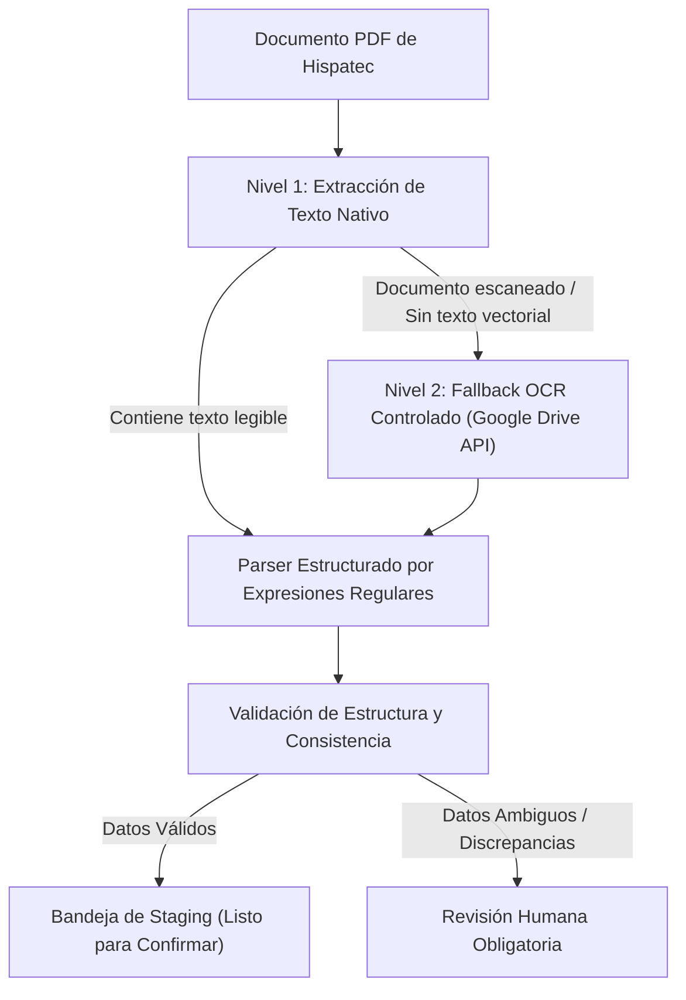
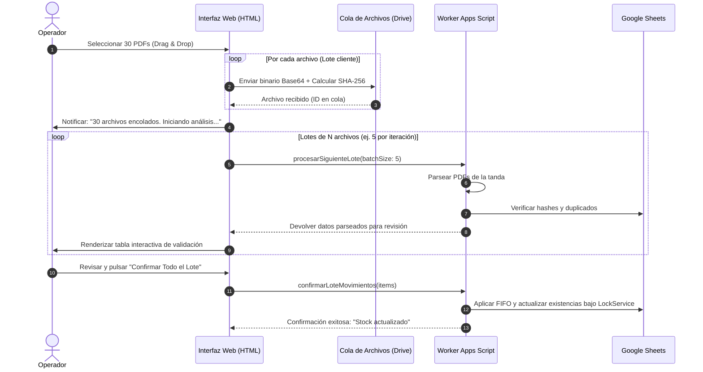

# IMPORT_SPECS.md — Especificaciones de Ingesta Documental y Extracción PDF

## 1. Estrategia de Extracción de Documentos PDF

Hispatec genera documentos con plantillas vectoriales donde el texto suele residir en capas seleccionables. STOCK-LIGHT aplica una **estrategia de extracción por niveles (tiered extraction)**:

### Reglas Clave:
1. **Prioridad Texto Nativo:** Extracción directa sin consumir cuotas de OCR de Google Drive ni incurrir en latencias de reconocimiento óptico.
2. **Prohibición de OCR Indiscriminado:** El OCR se activa única y exclusivamente como excepción cuando el PDF es puramente gráfico o carece de capas tipográficas.
3. **Cero Conjeturas:** Si un campo numérico no puede asociarse inequívocamente a "Cajas / Envases", el documento **nunca se contabiliza automáticamente**. Se detiene y se envía a la interfaz de revisión humana.

---

## 2. Especificación por Tipo de Documento Hispatec

### 2.1. Albarán de Compra (Entrada)
* **Objetivo:** Registrar ingresos de mercancía adquirida a proveedores o agricultores.
* **Mapeo de Campos:**

| Campo en Documento | Clasificación | Extraído como | Regla / Tratamiento |
| :--- | :---: | :--- | :--- |
| Fecha | Seguro | `fecha_documento` | Formato fecha del albarán convertida a `YYYY-MM-DD`. |
| Serie + Número | Seguro | `serie`, `numero` | Identificador del albarán (ej. `ACT26 / 12345`). |
| Proveedor | Seguro | `entidad_nombre` | Razón social o código de proveedor. |
| Código de Artículo | Seguro | `codigo_articulo` | Código numérico de artículo Hispatec (ej. `2112000`). |
| Descripción Artículo | Seguro | `nombre_articulo` | Denominación del producto (ej. `TOMATE ROSA M`). |
| Código de Envase | Seguro | `codigo_envase` | Código de envase si viene tipificado. |
| Descripción Envase | Seguro | `descripcion_envase`| Formato del envase (ej. `EPS 104`, `Madera 40x30`). |
| **Bultos / Envases / Cajas** | **Crítico** | **`cajas`** | **Único valor computable para el stock.** |
| Kilos (Bruto / Neto) | **Ignorado** | *Descartado* | **NO computable para stock.** No utilizar bajo ninguna circunstancia. |
| Partida | Informativo | `partida` | Almacenado como metadato informativo en la capa FIFO si existe. |
| Almacén | Informativo | `almacen` | Identificador del almacén de entrada si viene desglosado. |

---

### 2.2. Documento de Recepción de Mercancía (Excluido del MVP Activo)
> [!NOTE]
> Conforme a la Fase 2.1, el Documento de Recepción de Mercancía (medianería) queda **fuera del MVP activo**. El parser se conserva como módulo desacoplado para uso futuro, pero no se registra en el procesador activo de documentos.

---

### 2.3. Albarán de Salida (Fuente Activa Exclusiva de Salidas)
* **Objetivo:** Registrar la expedición de cajas vendidas o despachadas a clientes.
* **Mapeo de Campos:**

| Campo en Documento | Clasificación | Extraído como | Regla / Tratamiento |
| :--- | :---: | :--- | :--- |
| Fecha | Seguro | `fecha_documento` | Fecha de salida efectiva. |
| Serie + Número | Seguro | `serie`, `numero` | Identificador del albarán de venta (ej. `AVT26 / 8765`). |
| Cliente | Seguro | `entidad_nombre` | Razón social del destinatario comercial. |
| Código / Nombre Artículo | Seguro | `codigo_articulo` | Identificador del artículo expedido. |
| Envase / Presentación | Seguro | `codigo_envase` | Presentación del empaque vendido. |
| **Cajas Despachadas** | **Crítico** | **`cajas`** | **Cantidad real de cajas que se descuentan del FIFO.** |
| Kilos Salida | **Ignorado** | *Descartado* | Ignorado para el inventario de empaques. |

---

## 3. Catálogo de Campos Dudosos o Dependientes de Formato

Antes de iniciar la codificación de los parsers definitivos, deben clarificarse los siguientes puntos con documentos reales:

| Campo / Situación | Nivel de Riesgo | Duda Concreta | Acción de Mitigación |
| :--- | :---: | :--- | :--- |
| **Ambigüedad en Envase sin Código Numérico** | Alto | Algunos albaranes imprimen solo la descripción libre del envase (ej. "Caja Verde") sin el código formal de Hispatec. | Mapeo por tabla de sinónimos en la hoja `MAESTRO`. Si no se encuentra, detención para asignación manual. |
| **Subtotales de Palets vs Cajas** | Medio | Documentos que listan "Palets" y "Cajas por Palet" junto al total de cajas. | El parser debe validar que $\text{Palets} \times \text{Cajas/Palet} = \text{Total Cajas}$ y extraer únicamente el total final de cajas. |
| **Partida Múltiple en una misma línea** | Medio | Si una sola línea de albarán agrupa dos partidas diferentes con un total de cajas conjunto. | Se asigna a la capa FIFO con indicación de partidas múltiples o se desglosa si el documento trae subtotales. |
| **Albaranes Rectificativos / Devoluciones** | Medio | Signos negativos dentro de un albarán de salida o compra. | Validar si Hispatec utiliza series diferenciadas o líneas en negativo. |

---

## 4. Pipeline de Carga Masiva (Batch Processing)

El usuario debe poder subir lotes de 20, 30 o más PDFs de una sola vez sin que el sistema bloquee el navegador ni agote el tiempo máximo de Apps Script (6 minutos).

---

## 5. Muestras Reales Requeridas en el Workspace

Para calibrar los patrones de expresiones regulares y la extracción de datos sin inventar formatos ni vulnerar el aislamiento de carpetas:

> [!IMPORTANT]
> Se solicita depositar copias de documentos reales de muestra en la carpeta local:  
> `C:\Users\juanalberto\Desktop\ALMACEN\STOCK\docs\samples\`
> 
> Documentos necesarios:
> 1. Al menos **2 ejemplos de Albarán de Compra** (con diferentes proveedores y artículos).
> 2. Al menos **2 ejemplos de Recepción de Mercancía** (incluyendo medianería y bloque de resumen inferior).
> 3. Al menos **2 ejemplos de Albarán de Salida** (con diversos clientes y formatos de envase).
> 4. Copia o exportación de la **Hoja de Maestros** de artículos y envases oficiales de Hispatec.
> 5. Ejemplos de **archivos CSV** de apoyo si se utilizaron previamente para pruebas.
